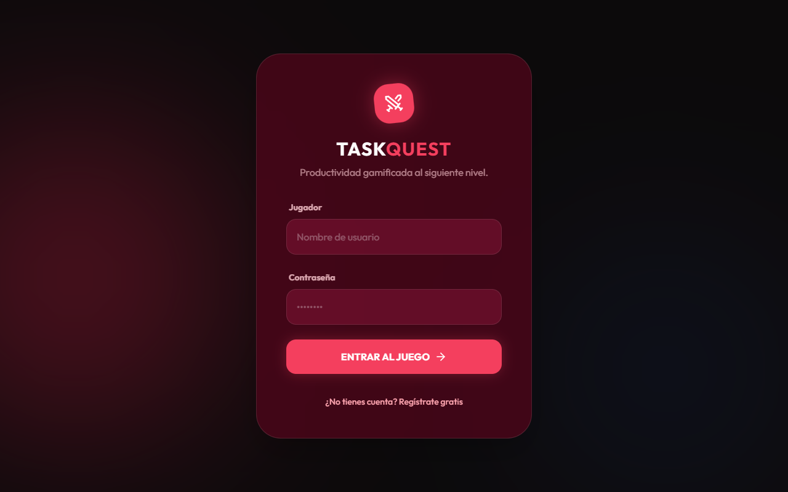
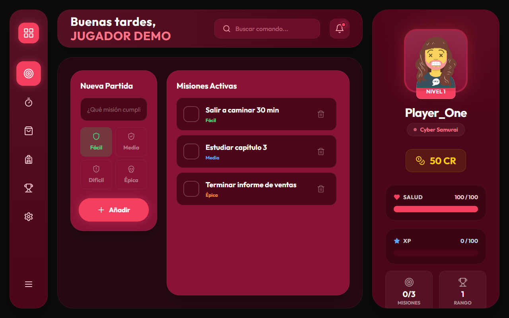
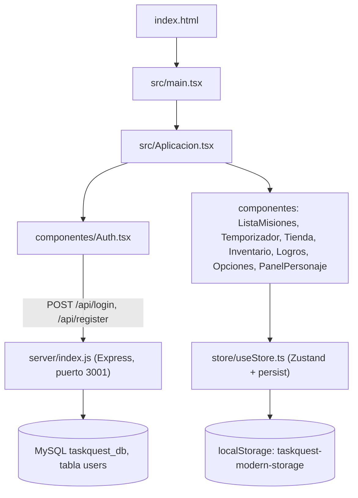

<div align="center">
  
  <h1>TaskQuest</h1>
  <p><b>Lista de tareas con mecánicas de RPG: cada misión cumplida da XP, créditos y niveles.</b></p>
  
  
  
  
  
  <p>
    <a href="#-inicio-rápido">Inicio rápido</a> ·
    <a href="#-características">Características</a> ·
    <a href="#-arquitectura">Arquitectura</a> ·
    <a href="#-pruebas">Pruebas</a> ·
    <a href="#-lo-que-todavía-no-existe">Limitaciones</a>
  </p>
</div>

**TaskQuest** es una app web en React + TypeScript donde las tareas son "misiones": según su dificultad dan XP y créditos, subes de nivel, compras recompensas en una tienda y usas un temporizador Pomodoro. El progreso vive en el navegador (`localStorage`). **No es** un producto terminado: la sesión es solo un pretexto de acceso, varias pantallas usan datos fijos y el repo conserva una versión anterior en JavaScript puro que ya no se usa.

## 🎬 Vista rápida

<div align="center">
  
  
</div>

## ✨ Características

| Característica | Detalle |
| --- | --- |
| Misiones | Añadir, completar (y desmarcar) y borrar tareas con 4 dificultades. |
| XP y créditos | Fácil 10, Media 25, Difícil 50, Épica 100 XP; los créditos son la mitad del XP. Desmarcar una tarea revierte ambos. |
| Niveles | Al llegar a `nivel × 100` XP subes de nivel; empiezas con 50 créditos y 100 de salud. |
| Pomodoro ("Focus") | Temporizador de 25 min de trabajo / 5 de descanso; al terminar da 20 créditos (`Temporizador.tsx`). |
| Tienda e inventario | Compra recompensas con créditos y consúmelas desde el inventario. |
| Logros | 4 logros calculados del estado: nivel 2, nivel 10, 5 misiones completadas, 200 créditos. |
| Datos | Exportar/importar el guardado y borrado total desde "Opciones". |
| Acceso | Registro/login contra un servidor Express + MySQL opcional; si el servidor no responde, entra en modo invitado sin contraseña real. |

## 🏗️ Arquitectura



## 🚀 Inicio rápido

| Requisito | Detalle |
| --- | --- |
| Node.js | Verificado con v24; no hay `engines` declarado |
| MySQL | Solo para el registro/login real (usuario `root` sin contraseña, valores fijos en `server/index.js`) |

1. Clona e instala (hay `package-lock.json`, así que también puedes usar `npm ci`):
   ```bash
   git clone https://github.com/Luiss2080/TaskQuest.git
   cd TaskQuest
   npm install
   ```
2. Arranca solo el frontend:
   ```bash
   npm run dev
   ```
   Abre la URL que imprime Vite. En la pantalla de acceso escribe cualquier usuario y contraseña: sin servidor se muestra "Modo Offline" y entras como invitado tras ~1,5 s.
3. Opcional, con backend y MySQL encendido: `npm run dev:all` (Express en `3001` + Vite).

<details>
<summary>Estructura de carpetas</summary>

```text
src/                 App activa (React + TS): Aplicacion.tsx, componentes/, store/useStore.ts
src/components/,
src/App.tsx          Copia en inglés de la UI, sin usar (main.tsx importa Aplicacion.tsx)
server/index.js      API de registro/login (Express + MySQL + bcrypt)
js/, estilos/, css/  Versión anterior en JavaScript puro; sin uso desde index.html
sw.js, manifest.json Herencia de la versión anterior (apuntan a rutas que ya no existen)
scripts/start.bat    Lanza npm run dev:all en Windows
```

</details>

## 🧪 Pruebas

No hay tests automatizados ni CI. Comprobación manual del 18/09/2026: la app arranca con Vite, se puede entrar como invitado, crear misiones y verlas en el panel (las capturas de arriba salen de ahí).

## 🔒 Seguridad

- Las contraseñas del servidor se guardan con `bcryptjs` (10 rondas) y las consultas SQL usan parámetros.
- Pero: no hay tokens ni sesiones en el servidor; el "login" solo guarda el nombre en `localStorage`, y el modo invitado permite entrar sin contraseña. CORS está abierto (`cors()` sin restricciones) y las credenciales de MySQL están escritas en el código. Solo apto para desarrollo local.

## 🚧 Lo que todavía no existe

- El progreso no se sincroniza con el servidor; solo el usuario se guarda en MySQL.
- La barra de búsqueda de la cabecera no hace nada.
- Las recompensas de la tienda se guardan en estado local del componente y no persisten al recargar.
- No hay categorías de tareas, rachas diarias ni quest diaria; esas funciones solo existen en la versión anterior sin uso.
- No hay archivo LICENSE (el README anterior decía ISC sin respaldo): todos los derechos reservados por defecto.

## 📄 Licencia

Sin licencia definida: todos los derechos reservados por defecto.

<div align="center"><sub>Hecho por Luiss2080 · TaskQuest</sub></div>
